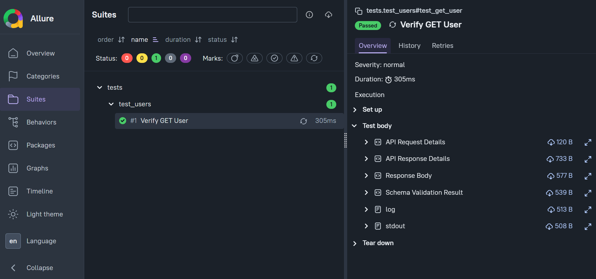
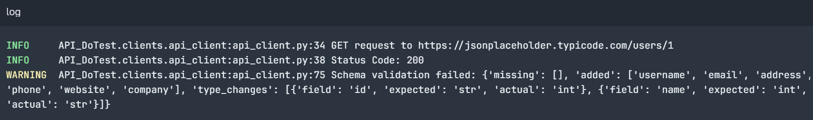
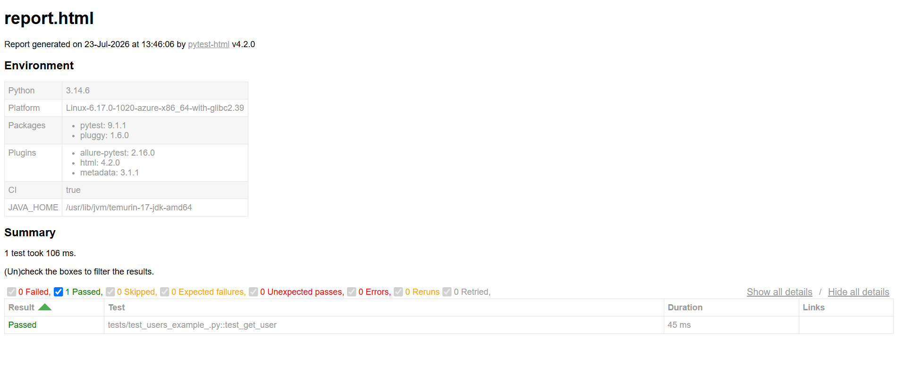

# API_DoTest

> A lightweight, modular API Automation Testing Framework built with Python, Pytest, Requests, Schema Validation, and Allure Reporting.


---

## Overview

API_DoTest is a reusable API automation testing framework designed to simplify REST API testing while keeping the framework lightweight and extensible.

The framework provides:

- REST API execution
- Automatic schema validation
- Automatic baseline schema generation
- Structured logging
- Allure reporting
- Pytest integration
- Configurable environments

The project follows a modular architecture, making it easy to maintain and extend.

---

## Features

- REST API Client using Requests Session
- Persistent HTTP Session Management
- Recursive JSON Schema Validation
- Automatic Schema Generation
- Baseline Schema Loader
- YAML Configuration Support
- Centralized Logging
- Allure Reporting
- Pytest Integration
- HTML Report Generation
- Environment-based Configuration

---

## Project Structure

```
API_DoTest/
│
├── baselines/
│   └── schemas/
│
├── clients/
│   └── api_client.py
│
├── config/
│   └── config.yaml
│
├── generators/
│   └── schema_generator.py
│
├── validators/
│   └── schema_validator.py
│
├── utilities/
│   ├── config_loader.py
│   ├── schema_loader.py
│   ├── allure_helper.py
│   └── logger.py
│
├── tests/
│
├── reports/
│
├── pytest.ini
├── requirements.txt
└── README.md
```

---

## Installation

Clone the repository

```bash
https://github.com/VickE1318/API_DoTest.git
```

Move into the project

```bash
cd API_DoTest
```

Create virtual environment

```bash
python -m venv .venv
```

Activate virtual environment

Windows

```bash
.venv\Scripts\activate
```

Install dependencies

```bash
pip install -r requirements.txt
```

---

## Running Tests

Execute all tests

```bash
pytest
```

Generate HTML Report

```bash
pytest --html=reports/report.html --self-contained-html
```

Generate Allure Results

```bash
pytest --alluredir=reports/allure-results
```

Generate Allure Report

```bash
allure serve reports/allure-results
```

---

## Example Test

```python
def test_get_user(api_client):
    response = api_client.get(
        "/users/1",
        schema_name="user"
    )

    assert response.status_code == 200
```

---

## Schema Validation

The framework compares the actual API response against a predefined baseline schema and validates:

- Missing fields
- Additional fields
- Data type mismatches
- Nested objects
- Nested arrays

---

## Automatic Schema Generation

If a baseline schema is unavailable, the framework can automatically generate one from the API response and save it for future validation.

---

## Reporting

The framework supports:

- Pytest HTML Reports
- Allure Reports
- Response Body Attachments
- Schema Validation Results
- Execution Logs

---

## Technologies Used

- Python
- Requests
- Pytest
- Allure Report
- PyYAML

---

## Screenshots







---

## Future Enhancements

- GitHub Actions CI/CD
- OAuth Authentication
- Response Time Assertions
- Data Driven Testing
- Parallel Execution
- OpenAPI Validation
- Retry Mechanism
- JSONPath Assertions

---

## Author

**Vignesh S**

QA Engineer | Manual & API Testing | Python Automation

GitHub:
https://github.com/VickE1318/API_DoTest.git
---

## License

This project is licensed under the MIT License.